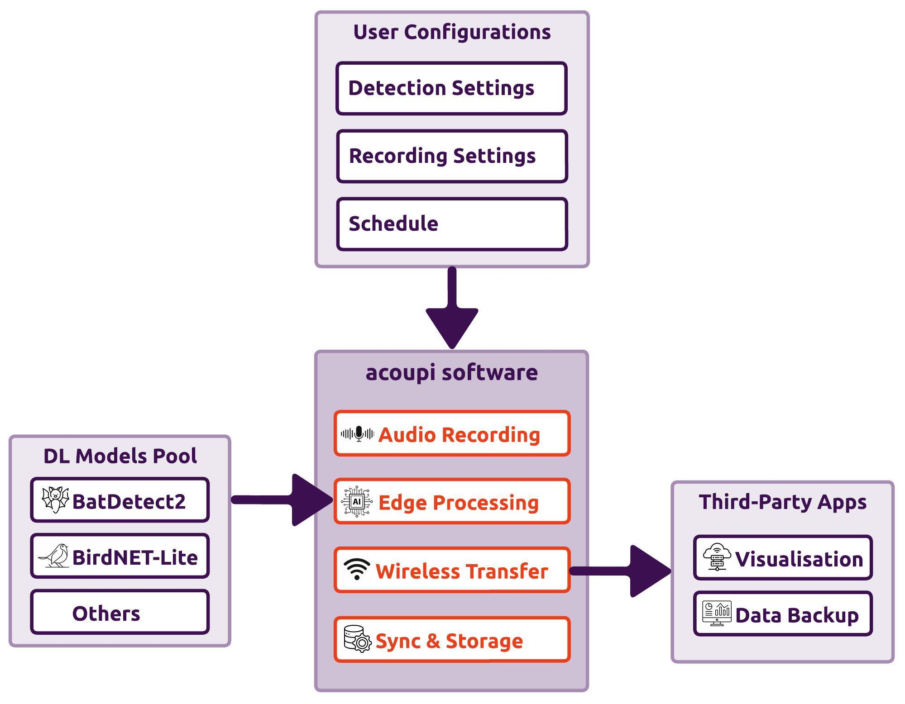

# acoupi

> [!TIP]
> Read the latest [documentation](https://acoupi.github.io/acoupi/)

#### Readme Content
- [What is acoupi?](#what-is-acoupi)
- [Requirements](#requirements)
- [Installation](#installation)
- [Ready to use AI Bioacoustic Classifiers](#ready-to-use-ai-bioacoustic-classifiers)
    - [BatDetect2](#batdetect2)
    - [BirdNET-Lite](#birdnet-lite-coming-soon)
- [Acoupi software architecture](#acoupi-software)
    - [Framework](#acoupi-framework)
    - [Application](#acoupi-application)
- [Features and Development](#features-and-development)

## What is acoupi? 
_acoupi_ is an open-source Python package that streamlines bioacoustic classifier deployment on edge devices like the Raspberry Pi.
It integrates and standardises the entire bioacoustic monitoring workflow, from recording to classification.
With various components and templates, _acoupi_ simplifies the creation of custom sensors, handling audio recordings, processing, classifications, detections, communication, and data management.

<figure>
    
    <figcaption><b>Figure 1: An overview of <i>acoupi</i> software.</b> Input your recording settings and deep learning model of choice, and <i>acoupi</i> handles the rest, sending detections where you need them.
</figcaption>
</figure>

## Requirements
_acoupi_ has been designed to run on single-board computer devices like the [Raspberry Pi](https://www.raspberrypi.org/) (RPi).
Users should be able to download and test _acoupi_ software on any Linux-based machines with Python version >=3.8,<3.12 installed.

- A Linux-based single board computer such as the Raspberry Pi 4B. 
- A SD Card with 64-bit Lite OS version installed.
- A USB Microphone such as an AudioMoth, a µMoth, an Ultramic 192K/250K.

> [!TIP]
> **Recomended Hardware**
> 
> The software has been extensively developed and tested with the RPi 4B. We advise users to select the RPi 4B or a device featuring similar specifications.

## Installation

To install and use the bare-bone framework of acoupi on your embedded device follow these steps: 

**Step 1:** Install _acoupi_ and its dependencies. 
```bash
curl -sSL https://github.com/acoupi/acoupi/raw/main/scripts/setup.sh | bash
```

**Step 2:** Configure an _acoupi_ program.

```bash
acoupi setup --program `program-name`
```

_acoupi_ includes two pre-built programs; a `default` and a `connected` program.
The `default` program only records and saves audio files based on users' settings. This program does not do any audio processing neither send any messages, being comparable to an AudioMoth.
The `connected` program is similar to the `default` program but with the added capability of sending messages to a remote server. 

Configure _acoupi_ `default` program"

```bash
acoupi setup --program acoupi.programs.default
```

Configure _acoupi_ `connected` program"

```bash
acoupi setup --program acoupi.programs.connected
```

**Step 3:** Start the deployment of your _acoupi's_ configured program.

```bash
acoupi deployment start
```

> [!TIP] 
> To check what are the available commands for acoupi, enter `acoupi --help`.


## Ready to use AI Bioacoustic Classifiers

_acoupi_ simplifies the use and implementation of open-source AI bioacoustic models. Currently, it supports two classifiers: the `BatDetect2`, developed by [@macodha and al.](https://doi.org/10.1101/2022.12.14.520490), and the `BirdNET-Lite`, developed by [@kahst and al.](https://github.com/kahst).

> [!WARNING]
> **Licenses and Usage**
> 
> Before using a pre-trained AI bioacoustic classifier, review its license to ensure it aligns with your intended use.
> `acoupi` programs built with these models inherit the corresponding model licenses.
> For further licensing details, refer to the [FAQ](https://acoupi.github.io/acoupi/faq/#licensing) section.

> [!WARNING]
> **Model Output Reliability**
> 
> Please note that `acoupi` is not responsible for the accuracy or reliability of model predictions.
> It is crucial to understand the performance and limitations of each model before using it in your project.

> [!IMPORTANT]
> **Please make sure you are aware of their license, if you use these models.**

### BatDetect2

The BatDetect2 bioacousticDL model has been trained to detect and classify UK bats species.
The [*acoupi_batdetect2*](https://acoupi.github.io/acoupi_batdetect2/) repository provides users with a pre-built _acoupi_ program that can be configured and tailored to their use cases.

Step 1: Install _acoupi_batdetect2_ program.

```bash
pip install acoupi_batdetect2
```

Step 2: Setup and configure _acoupi_batdetect2_ program.

```bash
acoupi setup --program acoupi_batdetect2.program
```

### BirdNET-Lite (COMING SOON!)

The BirdNET-Lite bioacousticDL model has been trained to detect and classify a large number of bird species.
The [*acoupi_birdnet*](https://acoupi.github.io/acoupi_birdnet/) repository provides users with a pre-build _acoupi_ program that can be configured and tailored to their use cases of birds monitoring.

Install _acoupi_birdnet_ program.

```bash
pip install acoupi_birdnet
```

Setup and configure _acoupi_birdnet_ program.

```bash
acoupi setup --program acoupi_birdnet.program
```

### In development 🐳🐘🐝

> [!TIP]
> **Interested in sharing your AI bioacousticmodel with the community?**
>
>_acoupi_ allows you to integrate your own bioacousticclassifier model. If you already have a model and would like to share it with the community, we'd  love to hear from you! We are happy to offer guidance and support to help include your classifier in the _acoupi_ list of "ready-to-use" AI bioacousticclassifiers. 

## _acoupi_ Software

Acoupi software is divided into two parts; the code-based architecture and the running application. The _acoupi_ framework is organised into layers that ensure standardisation of data while providing flexibility of configuration. The _acoupi_ application provides a simple command line interface (CLI) allowing users to configure the acoupi framework for deployment. 

### _acoupi_ Framework
The _acoupi_ software has been designed to provide maximum flexibility and keep away the internal complexity from a user. The architecture is made of four intricate elements, which we call the data schema, components, tasks, and programs. 

The figure below provides a simplified example of an acoupi program. This program illustrates some of the most important data schema, components, and tasks.

<figure>
    
    <figcaption><b>Figure 2: An example of a simplified <i>acoupi</i> program.</b>This example program implements the four tasks; audio recording, model, communication and management. Each task is composed of components        executing specific actions such as recording an audio file, processing it, sending results, and storing associated metadata. The components input or output data objects defined by the data schema to validate format of  information flowing between components and tasks.</figcaption>
</figure>


> [!TIP]
> **Refer to the [**Explanation**](https://acoupi.github.io/acoupi/explanation/section) of the documentation for full details on each of these elements.**

### _acoupi_ Application
An _acoupi_ application consists of the full set of code that runs at the deployment stage. This includes a set of scripts made of an acoupi program with user configurations, celery files to organise queues and workers, and bash scripts to start, stop, and reboot the application processes. An acoupi application requires the acoupi package and related dependencies to be installed before a user can configure and run it. The figure below gives an overview of key stages related to the installation, configuration and runtime of an acoupi application.

<figure>
    
    <figcaption><b>Figure 3: An visual diagram highlighting the elements of an <i>acoupi</i> application.</b>Three main steps are involved in setting up and running an <i>acoupi</i> application: (1) installation, (2) configuration, and (3) deployment.
    </figcaption>
</figure>

## Features and development
**acoupi** builds on other Python packages. The list of the most important packages and their functions is summarised below. For more information about each of them, make sure to check their respective documentation. 
- [PDM](https://pdm-project.org/2.10/) to manage package dependencies. 
- [Pydantic](https://docs.pydantic.dev/dev/) for data validation. 
- [Pytest](https://docs.pytest.org/en/7.4.x/) as a testing framework.
- [Pony-ORM](https://ponyorm.org/) for databse queries. 
- [Celery](https://docs.celeryq.dev/en/stable/getting-started/introduction.html) to manage the processing of tasks. 
- [Jinja](#jinja) for text templating. 
