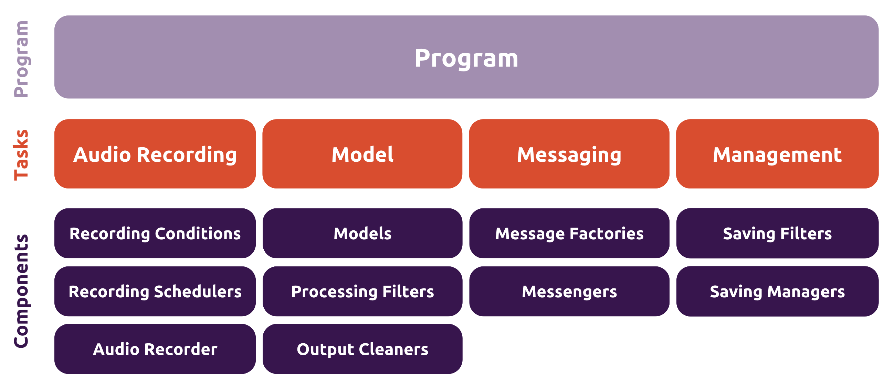

# Architecture Overview

Here we provide a brief overview of the **acoupi** framework. We recommend you
to read this section before diving into the details of the framework.

## Basic concepts

**acoupi** is a framework that allows you to build your own smart monitoring
sensor. The framework is organized into four increasingly complex layers:

1. [Data Schema](#data-schema)
2. [Components](#components)
3. [Tasks](#tasks)
4. [Programs](#programs)

 _Figure 1:
Overview of acoupi layers_

## Data Schema

The [`Data Schema`](../developer_guide/data_schema.md) layer is a fundamental
part of the **acoupi** framework, as it is where all the information handled by
the system is grouped and categorized.

The data objects are used by the other layers of the **acoupi** framework. By
defining the data objects and their properties, the data layer provides a clear
and consistent way of handling information throughout the framework.

## Components

The [`Components`](../developer_guide/components.md) layer form the building
blocks of acoupi. Each component has a single responsibility and performs a
specific action.

**acoupi** provides a library of built-in components that can be used to build
custom programs. The library provides components to record audio using a
microphone, save machine learning (ML) detections to a database, and send
messages to a remote server. These components have been thoroughly tested and
are ready to be used. Please check the
[`Components`](../developer_guide/components.md) section for a detailed list
of built-in components.

Additionally, **acoupi** allows you to create your own custom components. For
example, you can create a new component that would read the temperature from a
sensor. We have included a design guide for creating your own components in a
way that is compatible with the **acoupi** framework. Please check the
[`Components`](../developer_guide/components.md) section for more details.

## Tasks

The [`Tasks`](../developer_guide/tasks.md) are sequences of one or more
acoupi components executed in a specific flow. The **acoupi** framework defines
4-core tasks: recording, detection, messaging, and management to formulate a
complete AIoT bioacoustics sensor.

**Acoupi** provides tools to create tasks based on preset templates. For
example, you can create a novel task that runs a sequence of machine learning
models to detect specific sounds in the latest recording and stores relevant
detections in a database. It is possible to provide custom components to the
templates to further customise the task, while keeping the same standard
structure. Please check the [`Tasks`](../developer_guide/tasks.md) section
for more details.

## Programs

A [`Program`](../developer_guide/programs.md) is a full application that runs
on the device. A program is composed of one or more tasks. Some tasks run
periodically, while others are triggered by other tasks. Once the program starts
running, it will autonomously perform the tasks that have been defined.

**Acoupi** provides currently two prebuilt programs that you can use to monitor
your with device. The
[**BatDetect2**](https://github.com/acoupi/acoupi_batdetect2) program allow you
to record and classify UK Bats species while the
[**BirdNET**](https://github.com/acoupi/acoupi_batdetect2) program can be used
for identify bird species. Please check their related documentation for more
details.

You can also create your own programs to customise the behaviour of your device.
Please check the [`Program`](../developer_guide/programs.md) section for more
details.
