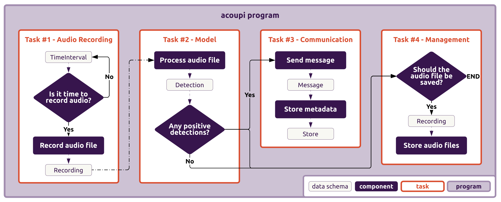
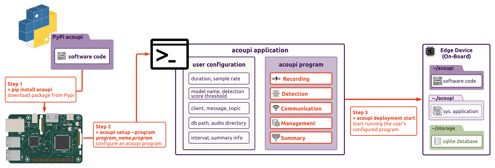

# Acoupi Architecture Overview

Acoupi has been architected with the aim to empower audio recording device deployed in the wild with edge processing and real-time feedback capabilities. The acoupi package provides a robust framework to facilitate data collection, processing, management and transfer. 

Acoupi software is divided into two parts; the code base framework and the running application.

The **_acoupi framework_** is organised into a layered architecture that ensures standardisation of data while providing flexibility of configuration.
The **_acoupi application_** provides a simple command line interface (CLI) allowing users to configure the acoupi framework for deployment.

### Acoupi Framework

The **acoupi** framework has been designed to provide maximum flexibility and keep away the internal complexity from a user.
The framework is made of four intricate elements, which we call the data schema, components, tasks, and programs.

<figure markdown="span">
    { width="90%" }
    <figcaption><b>Example of a simplified acoupi program.</b> An acoupi program illustrating some of the most important data schema, components, and tasks.
</figure>

### Acoupi Application

An acoupi application consists of the full set of code that runs at the deployment stage. This includes a set of scripts made of an acoupi program with user configurations, celery files to organise queues and workers, and bash scripts to start, stop, and reboot the application processes. 

<figure markdown="span">
    { width="90%" }
    <figcaption><b>The series of steps required to start an acoupi application.</b>To have an acoupi application running on a device, three steps are required: (1) Installation of the acoupi package, (2) User configuration of an acoupi program, (3) Start of a deployment.
</figure>

### Features and development

The acoupi package builds on other Python packages. The list of the most important packages and their functions is summarised below.
For more information about each of them, make sure to check their respective documentation.

- [uv](https://docs.astral.sh/uv/) to manage package dependencies.
- [Pydantic](https://docs.pydantic.dev/dev/) for data validation.
- [Pytest](https://docs.pytest.org/en/7.4.x/) as a testing framework.
- [Pony-ORM](https://ponyorm.org/) for databse queries.
- [Celery](https://docs.celeryq.dev/en/stable/getting-started/introduction.html) to manage the processing of tasks.
- [Jinja](#jinja) for text templating.
