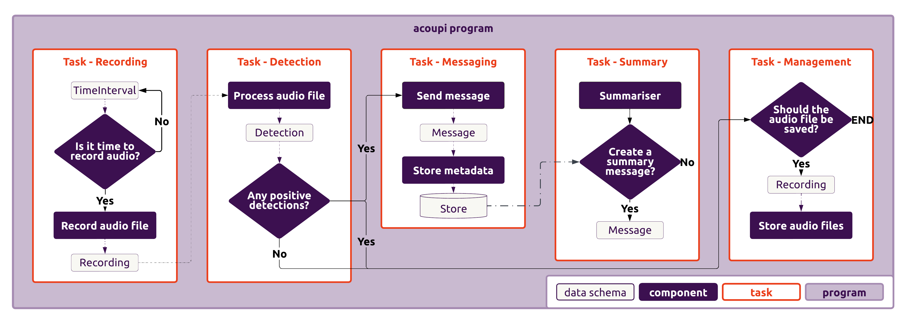

# Architecture

_acoupi_ is designed with the primary goal of simplifying the creation of smart bioacoustic sensors on edge devices.
We aim to provide a user-friendly framework that allows you to focus on defining your program's behavior—specifying which models to execute, recording triggers, etc.—without being burdened by the intricacies of program execution and task orchestration.
To achieve this, _acoupi_ is structured into two core components:

- [**Program Specs**](#program_specification): This component focuses on empowering users to specify their desired program behaviour with minimal input.
- [**System**](#system): This component handles the execution and management of your defined program.

In the following sections, we'll provide a high-level overview of each component before delving deeper into their respective functionalities and implementation details.

## Program Specification

In _acoupi_, a [**"program"**](programs.md) encompasses the complete behavior of a deployed bioacoustic sensor, including recording triggers, AI models used, data storage and communication protocols, and more.
To strike a balance between ease of use and flexibility, _acoupi_ offers multiple tiers for specifying your desired program, catering to varying levels of customization and complexity.

??? info "What is a Program?"

    For more details on what a program is in the context of _acoupi_, read the [Programs Section](programs.md).

Ideally, most users should be able to achieve their goals by simply modifying a high-level configuration layer.
However, for technically oriented users, _acoupi_ provides the ability to customize every aspect of the sensor program while still benefiting from the underlying management layer.

### Methods of Program Specification

For ease of use, _acoupi_ offers pre-built programs that can be configured to meet specific user requirements.
This approach is ideal for users who want to replicate established monitoring protocols with minor adjustments to accommodate their setup.

However, in cases where creating a new program from scratch is necessary, _acoupi_ provides several tools to simplify this process:

- **Program Templates**: When you primarily need to change the AI model or make minor modifications while retaining most of the default behavior, program templates offer a quick and easy way to create a new program.

- **Task Templates**: _acoupi_ programs consist of various [**tasks**](tasks.md), such as recording, messaging, and file management.
    Task templates provide a streamlined approach to create these common tasks with customizable sections, further simplifying program development.

- **Pre-defined Components**: _acoupi_ offers a collection of pre-defined [**components**](components.md) that provide specific functionalities, such as sending messages to a server or recording audio.
    These components are designed for easy integration into program tasks.

- **Custom Components**: For scenarios requiring more specialized behavior, _acoupi_ enables the creation of custom components through templates or interfaces.
    These ensure seamless integration with the rest of the program while providing the flexibility to tailor functionality to your exact needs.

### Program Configuration

To enhance the reusability of created programs, _acoupi_ promotes easy configurability.
When creating a program, users are encouraged to specify a configuration schema, which outlines all configurable parameters.
To streamline this process and ensure that provided configurations adhere to the schema, we leverage [Pydantic](https://docs.pydantic.dev/dev/).
This guarantees that program users can confidently provide configurations that align with the program creator's intentions.

### Data Standardization

To ensure consistency and facilitate data flow between components and tasks, _acoupi_ uses clearly defined [**data structures**](data_schema.md) for commonly handled bioacoustic sensor data, such as "Recording" and "Detection".
This standardization improves program clarity and understanding, promoting a more uniform and predictable data handling process throughout.

<figure markdown="span">
    { width="110%" }
    <figcaption><b>Example of a simplified acoupi program.</b> An acoupi program illustrating some of the most important data schema, components, and tasks.
</figure>

## System

The _acoupi_ System is responsible for executing and managing user-defined programs.
It facilitates user interaction to specify program selection, configuration, and deployment.
Additionally, it handles configuration and program file management, ensuring the program's state remains healthy and operational.
The system also guarantees robust and timely execution of program tasks.

Key functionalities include:

- **Command-Line Interface (CLI)**: _acoupi_ provides a [CLI](../reference/cli.md) enabling users to instruct _acoupi_ to execute specific programs, modify configurations, check device status, and most importantly, initiate and terminate device deployments.

- **Management**: _acoupi_ tracks the running program, its configurations, and execution logs.
    This enables observation of sensor functionality and facilitates error tracking.

- **Orchestration**: _acoupi_ leverages Celery, an orchestration framework, to execute all tasks concurrently and in a fault-tolerant manner.
    This ensures efficient and reliable program operation.

<figure markdown="span">
    { width="110%" }
    <figcaption><b>The series of steps required to start an acoupi application.</b>To have an acoupi application running on a device, three steps are required: (1) Installation of the acoupi package, (2) User configuration of an acoupi program, (3) Start of a deployment.
</figure>

## Our tools

To prioritize robustness and reliability, _acoupi_ leverages a selection of established tools and frameworks, entrusting complex functionalities to battle-tested solutions.
The _acoupi_ package is built upon a foundation of other Python packages.
The most crucial packages and their functions are summarized below.
For detailed information about each package, please refer to their respective documentation.

- [uv](https://docs.astral.sh/uv/): Manages package dependencies and the development process.
- [Pydantic](https://docs.pydantic.dev/dev/): Handles data validation and schema enforcement.
- [Pytest](https://docs.pytest.org/en/7.4.x/): Serves as the testing framework for ensuring code quality and correctness.
- [Pony-ORM](https://ponyorm.org/): Simplifies database queries and interactions.
- [Celery](https://docs.celeryq.dev/en/stable/getting-started/introduction.html): Manages the processing and orchestration of tasks.
- [Jinja](https://jinja.palletsprojects.com/en/3.1.x/): Facilitates text templating for generating dynamic content.
