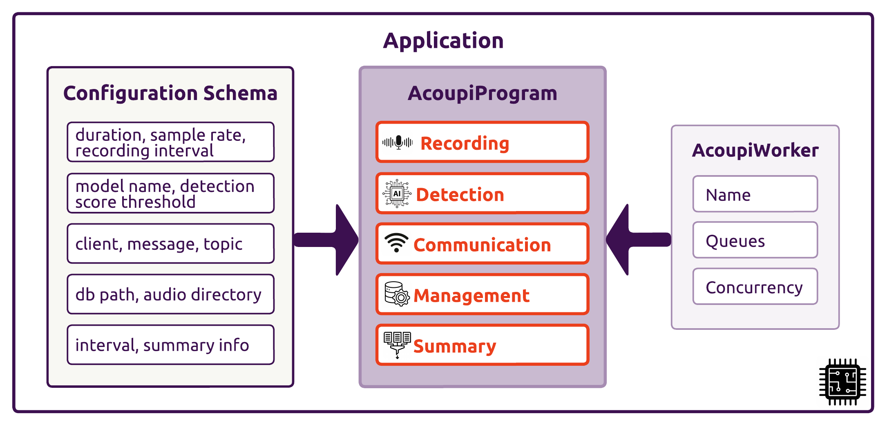

# Programs (acoupi framework)

An _acoupi_ program is a set of instructions that dictate the behaviour of a smart bioacoutics sensor. 
It defines the tasks the sensor performs, how those tasks are configured, and the underlying execution environment.
The **program** is the heart of an acoupi application.

## Elements of Programs 

An _acoupi_ program include three essential elements: tasks, configuration schema, and worker configuration.
Tasks outline the operations within the program.
A configuration schema defines the program's configuration structure, and worker configuration governs task execution.

* **Tasks** outline the operations of a program, these are individual units of work performing a set of specific actions. Tasks are orchestrated by an _acoupi_ program by specifying the task function, its schedule and dependencies.
    
    - _Function_: The functionality of the task. This is the sequence of _acoupi_ compoments specifiying what actions the task perform.
    - _Schedule_: When and how often the task runs (e.g., continuously, at specific intervals, triggered by an event).
    - _Dependencies_: How the task relates to other tasks in the program (e.g., does it need to run before or after another task?).

* **Configuration Schema**: This acts as a blueprint for customising your program.
    It defines the parameters and options that users can modify to adjust the program's behavior.
    A well-defined schema ensures your program is flexible and adaptable to different needs and scenarios.

* **Worker Configuration**: This encompasses lower-level settings related to how the program runs on the device.
    For simplicity, this guide uses the default worker configuration, allowing you to focus on the core aspects of program design.

To represent these program elements in code, _acoupi_ defines a Python class called `AcoupiProgram` ([`acoupi.programs.AcoupiProgram`][acoupi.programs.AcoupiProgram]).
This class encapsulates all the necessary information for _acoupi_ to execute a program on a device.

<figure markdown="span">
    { width="90%" }
    <figcaption><b>Overview of an acoupi application.</b> A configuration schema provides the settings to run acoupi program's tasks. Acoupi workers are configured to orchestrate and execute the tasks.
</figure>

!!! Tip

    Acoupi offers users the flexibility to either develop your own custom programs or deploy existing ones.
    Please refer to the [_Tutorials_](../tutorials/index.md) for step-by-step instructions on how to configure and deploy pre-built programs, and the [_How-to Guides: Programs_](../howtoguide/programs.md) for a detailed guide on how to create your own custom program.


## Program Configuration

Each program within **acoupi** is accompanied by a configuration schema.
This schema serves as a blueprint, delineating the structure and data types of the configuration variables.
Implementation of the schema is realized through a `pydantic.BaseModel` object.

When configuring a program for execution within the **acoupi** framework, the associated configuration schema plays a crucial role.
The schema guides the user through the definition of essential fields, facilitated by the utilisation of [`acoupi.system.parse_config_from_args()`][acoupi.system.parse_config_from_args] function.
These configurations are subsequently stored for reference.

During program execution, **acoupi** leverages the stored configurations.
As the program starts, these configurations are loaded and provided to the program using the [`acoupi.system.AcoupiProgram.setup()`][acoupi.programs.AcoupiProgram.setup] method.
This instantiation process ensures that the program is equipped with accurate and pertinent configurations.

!!! Example "a dummy program"

    ```python
    from typing import Optional

    from pydantic import BaseModel, Field

    from acoupi import components, data, tasks
    from acoupi.compoments import types
    from acoupi.programs.core import (
        AcoupiProgram, 
        AcoupiWorker, 
        WorkerConfig,
    )

    class DummyConfig(BaseModel):
        key: str
        value: int

    class Dummy_ConfigSchema(BaseModel):
        dummy: DummyConfig = Field(default_factory=DummyConfig)

    class Program(AcoupiProgram[Dummy_ConfigSchema]):

        configuration_schema: Dummy_ConfigSchema
        """Configuration Schema for a basic program."""

        worker_config =  Optional[WorkerConfig] = WorkerConfig()
        """Configuration for acoupi workers."""

        dummy_component: types.DummyComponent

        def setup(self, config: Dummy_ConfigSchema):
            """Initialise program compoment."""
            self.dummy_component = self.configure_dummycomponent(config)
            self.register_task(config)
            super().setup(config)

            def configure_dummycomponent(self, config) -> types.DummyComponent:
                return components.DefaultDummy(
                    key=config.dummy.key,
                    value=config.dummy.value,
                )
            
            def create_task(self, config):
                task_configuration = self.configure_task(config)
                return tasks.generate_task(
                    compoment=self.dummy_component, 
                    logger=self.logger.getChild("task_name"),
                )
            
            def register_task(self, config: ProgramConfig):
                dummy_task = self.create_task(self)
                self.add_task(
                    function=dummy_task,
                    schedule=datetime.timedelta(),
                    queue="queue_name"
                )
    ```

## Pre-Built Programs

_acoupi_ provides currently a small number of pre-built programs that users can configure and deploy from a command-line interface.

- __default__: The _acoupi_ _default_ program is the most basic acoupi program. This program only performs two actions, the recording and management of audio files. 

- __connected__: The _acoupi_ _connected_ program adds messaging capabilities to the _acoupi default_ program. This program allows users to configure a [messenger](../explanation/components.md/#messengers) to send messages to a remote server.

- __batdetect2__: The [_acoupi_batdetect2_](https://github.com/acoupi/acoupi_batdetect2) program is a fully configurable program performing, recording, detection, management, and messaging actions. This program incorporates the [__BatDetect2__](https://github.com/macaodha/batdetect2) deep-learning classifier that is trained to detect and classify UK Bats species.

- __birdnet__: The [_acoupi_birdnet_](https://github.com/acoupi/acoupi_birdnet) program is a fully configurable program performing, recording, detection, management, and messaging actions. This program incorporates the [__BirdNET__](https://github.com/kahst/BirdNET-Analyzer) deep-learning classifier that is trained to detect and classify bird species.
