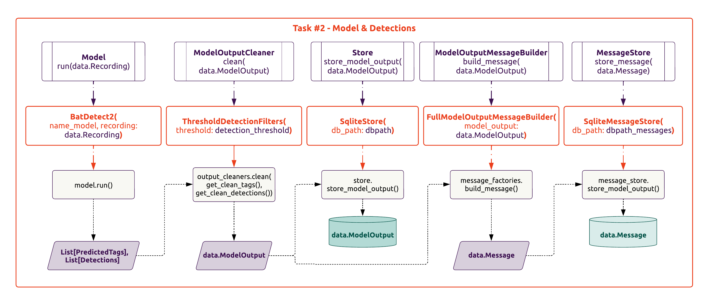

# Tasks (acoupi framework)

## Introduction 

Tasks are individual units of work performing a set of specific actions. These are built as a sequence of one or more _acoupi_ components. 
The _acoupi_ framework defines 6 tasks recording, detection, messaging, management, summary, and heartbeat. 

## Understanding Tasks

Tasks are characterised by three elements:

- **Function**: The functionality of the task. This is the sequence of _acoupi_ compoments specifiying what actions the task perform.
- **Schedule**: When and how often the task runs (e.g., continuously, at specific intervals, triggered by an event).
- **Dependencies**: How the task relates to other tasks in the program (e.g., does it need to run before or after another task?).

In its essence, each task is a Python function that is orchestrated and syncronised within an[_acoupi program_](../explanation/programs.md). 

??? info

    Please refer to [_Explanation: System Section_](system.md) to learn more about the registration and orchestration of the tasks in the Celery app.

## Overview Tasks

??? Example "a dummy acoupi task"

    ```python
    import logging
    from typing import Optional

    from acoupi import data
    from acoupi.components import types

    logger = logging.getLogger(__name__)
    logger.setLevel(logging.INFO)

    def generate_dummy_acoupi_task(
        component_1: types.DummyComponent1,
        component_2: types.DummyComponent2,
        logger: logging.Logger = logger, 
    ) -> Optional[data.DataSchema]:
        """Generate a dummy task using various acoupi components."""

        def dummy_acoupi_task() -> Optional[data.DataSchema]:
            """Create the structure of a dummy task."""

            output = component_1.associated_method_one()
            result = component_2.associated_method_two(output)

            logger.info(f"Dummy Task result is: {result}")

        return dummy_acoupi_task
    ```

#### Recording

The [Recording](../reference/tasks.md) task is reponsible for recording an audio file and storing the metadata in the store.
The recording task builds upon the acoupi components: `AudioRecorder` to capture the audio, `RecordingCondition` to determine whether a recording should occur, and `Store` to save the metadata of a recording.

<figure markdown="span">
    { width="110%" }
    <figcaption><b>Example of the audio recording task.</b> The audio recording is made of various acoupi compoments: RecordingCondition, RecordingScheduler, AudioRecording, and Store.
</figure>

!!! Example "Structure of a recording task"

    ```python
    from acoupi import components, tasks

    recording_task = tasks.generate_recording_task(
        recorder=components.PyAudioRecorder(),
        store=components.SqliteStore(),
        recording_conditions=components.IsInInterval(),
        logger=logger.getChild("recording"),
    )

    ```

#### Detection

The [Detection](../reference/tasks.md) task is reponsible for processing audio files.
The task builds upon the acoupi compoments: `ProcessingFilter` to determine if a recording should be processed, `Model` to run an audio classifier model, `ModelOutputCleaner` to cleans the model outputs, `MessageBuilder` to generate messages with the detected information, and `Store` and `MessageStore` to save the metadata of the procesed recordings and store the messages to be sent.

<figure markdown="span">
    { width="110%" }
    <figcaption><b>Example of the detection task.</b> The detection process audio recordings, it is made of various acoupi compoments: Model, ModelOutputCleaner, Store, MessageBuilder, and MessageStore.
</figure>

!!! Example "Structure of a detection task using BatDetect2 classifier"

    ```python
    from typing import Optional

    from acoupi import components, data, tasks
    
    from acoupi_batdetect2.model import BatDetect2

    recording_task = tasks.generate_detection_task(
        store=components.SqliteStore(),
        model=BatDetect2()
        message_store=components.SqliteMessageStore(),
        message_factories=[compoments.FullModelOutputMessageBuilder()],
        logger=logger.getChild("detection"),
        output_cleaners=Optional[components.ThresholdDetectionCleaner()],
    )
    ```

#### Messaging

The [Messaging](../reference/tasks.md) task is reponsible for communication with a remote server.
It uses the `Messenger` compoment to define the communication protocol for sending messages and the `MessageStore` compoment to check if there are any pending messages to be sent.

#### Management

The [Management](../reference/tasks.md) task is reponsible for managing recording files.
It handles the saving, deleting, and movement of files using the `SavingFilters` and `SavingManagers` compoment, and keep track of any files movements by update the store.

<figure markdown="span">
    { width="110%" }
    <figcaption><b>Example of the messaging and management task.</b> The message task sends messages to a remote server. The management task handles the movement, saving, and deletion of recordings. Compoments use in both tasks are: Messenger, SavingFilters, SavingManagers, Store, and MessageStore.
</figure>

#### Summary

The [Summary](../reference/tasks.md) task is reponsible for creating summary messages to be sent to a remote server.
It uses the `Summariser` compoment and the `Messenger` compoment to define the communication protocol for sending these messages.
The summary task is useful for providing aggregrate information on detections or system status updates, such as daily report with details like avaialbe storage and battery capacity.
