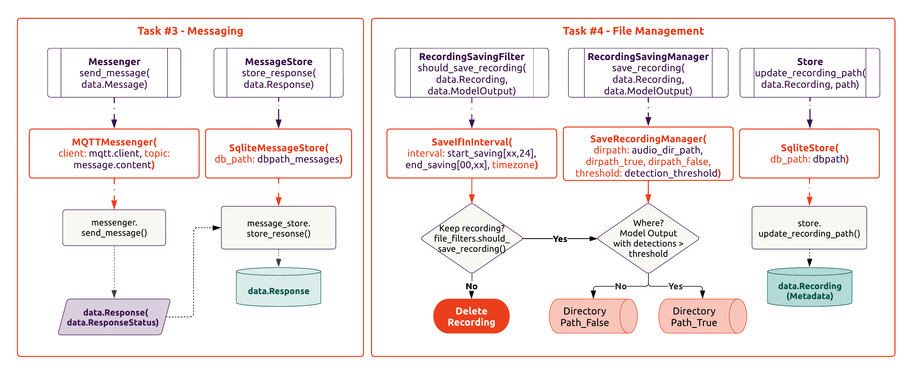

# Tasks (acoupi framework)

The **tasks** are sequences of one or more acoupi components executed in a specific flow. 

The **acoupi** framework defines 5 tasks: recording, detection, messaging, management, and summary.

In its essence, each task is a Python function that are orchestrated and syncronised using the Celery framework.  Some tasks run periodically, while others are triggered by other tasks. The combination of tasks form the acoupi program. 

??? info
    Please refer to [*Explanation: System Section*](system.md) to learn about the registration and orchestration of the tasks in the Celery app.

## Overview Tasks

??? Tip
     Please check the [*How To Guides: Tasks Section*](../how_to_guide/components.md) for a step-by-step guide about building your own task.

#### Recording
The [Recording](../reference/tasks) task is reponsible for recording an audio file and storing the metadata in the store. The recording task builds upon the acoupi components: `AudioRecorder` to capture the audio, `RecordingCondition` to determine whether a recording should occur, and `Store` to save the metadata of a recording. 

<figure markdown="span">
    { width="110%" }
    <figcaption><b>Example of the audio recording task.</b> The audio recording is made of various acoupi compoments: RecordingCondition, RecordingScheduler, AudioRecording, and Store.
</figure>

#### Detection
The [Detection](../reference/tasks) task is reponsible for processing audio files. The task builds upon the acoupi compoments: `ProcessingFilter` to determine if a recording should be processed, `Model` to run an audio classifier model, `ModelOutputCleaner` to cleans the model outputs, `MessageBuilder` to generate messages with the detected information, and `Store` and `MessageStore` to save the metadata of the procesed recordings and store the messages to be sent. 

<figure markdown="span">
    { width="110%" }
    <figcaption><b>Example of the detection task.</b> The detection process audio recordings, it is made of various acoupi compoments: Model, ModelOutputCleaner, Store, MessageBuilder, and MessageStore.
</figure>

#### Messaging
The [Messaging](../reference/tasks) task is reponsible for communication with a remote server. It uses the `Messenger` compoment to define the communication protocol for sending messages and the `MessageStore` compoment to check if there are any pending messages to be sent. 

#### Management
The [Management](../reference/tasks) task is reponsible for managing recording files. It handles the saving, deleting, and movement of files using the `SavingFilters` and `SavingManagers` compoment, and keep track of any files movements by update the store. 

<figure markdown="span">
    { width="110%" }
    <figcaption><b>Example of the messaging and management task.</b> The message task sends messages to a remote server. The management task handles the movement, saving, and deletion of recordings. Compoments use in both tasks are: Messenger, SavingFilters, SavingManagers, Store, and MessageStore.
</figure>

#### Summary 
The [Summary](../reference/tasks) task is reponsible for creating summary messages to be sent to a remote server. It uses the `Summariser` compoment and the `Messenger` compoment to define the communication protocol for sending these messages. The summary task is useful for providing aggregrate information on detections or system status updates, such as daily report with details like avaialbe storage and battery capacity. 