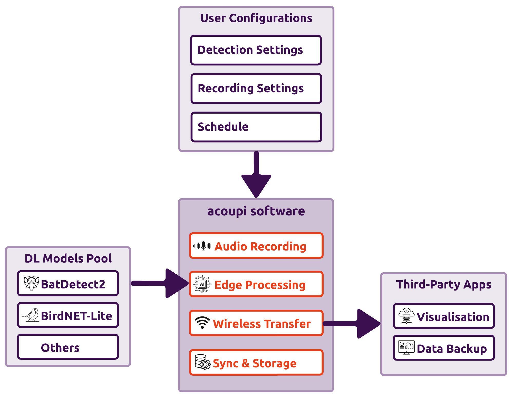

# acoupi

## What is acoupi?

_acoupi_ is an open-source Python package that streamlines bioacoustic classifier deployment on edge devices like the Raspberry Pi.
It integrates and standardises the entire bioacoustic monitoring workflow, from recording to classification.
With various components and templates, _acoupi_ simplifies the creation of custom sensors, handling audio recordings, processing, classifications, detections, communication, and data management.

<figure markdown="span">
    { width="50%" }
    <figcaption><b>An overview of <i>acoupi</i> software.</b> Input your recording settings and deep learning model of choice, and <i>acoupi</i> handles the rest, sending detections where you need them.
</figure>

## Requirements

_acoupi_ has been designed to run on single-board computer devices like the [Raspberry Pi](https://www.raspberrypi.org/) (RPi).
Users should be able to download and test _acoupi_ software on any Linux-based machines with Python version >=3.8,<3.12 installed.

- A Linux-based single board computer such as the Raspberry Pi 4B.
- A SD Card with 64-bit Lite OS version installed.
- A USB Microphone such as an [AudioMoth USB Microphone](https://www.openacousticdevices.info/audiomoth) or an Ultramic 192K/250K.

??? tip "Recommended Hardware"

    The software has been extensively developed and tested with the RPi 4B.
    We advise users to select the RPi 4B or a device featuring similar specifications.

## Installation

To install and use the bare-bone framework of acoupi on your embedded device follow these steps: 

**Step 1:** Install _acoupi_ and its dependencies.

!!! Example "CLI Command: _acoupi_ installation"

    ```bash
    curl -sSL https://github.com/acoupi/acoupi/raw/main/scripts/setup.sh | bash
    ```

**Step 2:** Configure an _acoupi_ program.

!!! Example "CLI Command: _acoupi_ configuration"

    ```bash
    acoupi setup --program `program-name`
    ```

`acoupi` includes two pre-built programs; a `default` and a `connected` program.
The `default` program only records and saves audio files based on users' settings. This program does not do any audio processing neither send any messages, being comparable to an AudioMoth.
The `connected` program is similar to the `default` program but with the added capability of sending messages to a remote server. 

!!! Example "CLI Command: configure _acoupi_ `default` program"

    ```bash
    acoupi setup --program acoupi.programs.default
    ```

!!! Example "CLI Command: configure _acoupi_ `connected` program"

    ```bash
    acoupi setup --program acoupi.programs.connected
    ```

**Step 3:** Start the deployment of your _acoupi's_ configured program.

!!! Example "CLI Command: _acoupi_ deployment"

    ```bash
    acoupi deployment start
    ```

??? tip "Using acoupi from the command line"

    To check what are the available commands for acoupi, enter `acoupi --help`. Also look at the [CLI documentation](reference/cli.md) for further info.

## Ready to use AI Bioacoustic Classifiers 🚀

_acoupi_ simplifies the use and implementation of open-source AI bioacoustic models.
Currently, it supports two classifiers: the `BatDetect2`, developed by [@macodha and al.](https://doi.org/10.1101/2022.12.14.520490), and the `BirdNET-Lite`, developed by [@kahst and al.](https://github.com/kahst).

??? warning "Licenses and Usage"

    Before using a pre-trained AI bioacoustic classifier, review its license to ensure it aligns with your intended use.
    `acoupi` programs built with these models inherit the corresponding model licenses.
    For further licensing details, refer to the [FAQ](faq.md#licensing) section.

??? warning "Model Output Reliability"

    Please note that `acoupi` is not responsible for the accuracy or reliability of model predictions.
    It is crucial to understand the performance and limitations of each model before using it in your project.

### BatDetect2 🦇

The BatDetect2 bioacousticDL model has been trained to detect and classify UK bats species.
The [**acoupi_batdetect2**](https://github.com/acoupi/acoupi_batdetect2) repository provides users with a pre-built _acoupi_ program that can be configured and tailored to their use cases.

!!! Example "CLI Command: Install _acoupi_batdetect2_ program."

    ```bash
    pip install acoupi_batdetect2
    ```
!!! Example "CLI Command: Setup and configure _acoupi_batdetect2_ program."

    ```bash
    acoupi setup --program acoupi_batdetect2.program
    ```

### BirdNET-Lite 🦜 (COMING SOON!)

The BirdNET-Lite bioacoustic DL model has been trained to detect and classify a large number of bird species.
The [**acoupi_birdnet**](https://github.com/acoupi/acoupi_birdnet) repository provides users with a pre-build _acoupi_ program that can be configured and tailored to their use cases of birds monitoring.

!!! Example "CLI Command: Install _acoupi_birdnet_ program."

    ```bash
    pip install acoupi_birdnet
    ```
!!! Example "CLI Command: Setup and configure _acoupi_birdnet_ program."

    ```bash
    acoupi setup --program acoupi_birdnet.program
    ```

###  In development 🐳🐘🐝
!!! Tip "Interested in sharing your AI bioacoustic model with the community?"

    _acoupi_ allows you to integrate your own bioacousticclassifier model. If you already have a model and would like to share it with the community, we'd  love to hear from you! We are happy to offer guidance and support to help include your classifier in the _acoupi_ list of "ready-to-use" AI bioacoustic classifiers. 


## Navigate the docs 📖

Get to know _acoupi_ better by exploring the following sections of the documentation.

<table>
    <tr>
        <td>
            <a href="tutorials">Tutorials</a>
            <p>Step-by-step information on how to install, configure and deploy <i>acoupi</i> for new users.</p>
        </td>
        <td>
            <a href="howtoguide">How-To Guides</a>
            <p>Guides to learn how to customise and built key elements of <i>acoupi</i>.</p>
        </td>
    </tr>
    <tr>
        <td>
            <a href="explanation">Explanation</a>
            <p>Overview of the key elements of <i>acoupi</i>: what they are and how they work.</p>
        </td>
        <td>
            <a href="reference">Reference</a>
            <p>Technical information refering to <i>acoupi</i> code.</p>
        </td>
    </tr>
</table>

!!! tip "Important"

    We would love to hear your feedback about the documentation. We are always looking to hearing suggestions to improve readability and user's ease of navigation. Don't hesitate to reach out if you have comments!

*[CLI]: Command Line Interface
*[DL]: Deep Learning
*[RPi]: Raspberry Pi
